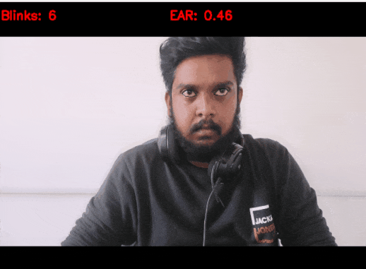
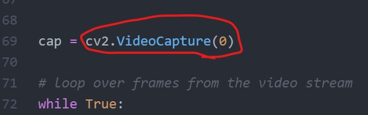

# Eye Blinking Counting System

## Introduction

A simple prototype to count the number of times a human eye blinks. This program could be used to count how many times a human eye blinks.

This prototype could be used to build sleeping detection and other medical-related computer vision applications.

## Technologies & Frameworks

- Python 3.8
- Scipy module
- Imutils module
- Cmake module
- DLIB Module
- OpenCV Module
- Wget

### Why Scipy?

SciPy is a free and open-source Python library used for scientific computing and technical computing. SciPy contains modules for optimization, linear algebra, integration, interpolation, special functions, FFT, signal and image processing, ODE solvers and other tasks common in science and engineering.

**Note:** We use SciPy module to calculate distances in eyes.

### Why Imutils?

Imutils are a series of convenience functions to make basic image processing functions such as translation, rotation, resizing, skeletonization, and displaying Matplotlib images easier with OpenCV and Python.

### Why Cmake?

The DLIB module is depended on the cmake, therefore, we should install the cmake first in order to install DLIB.

Cmake is cross-platform free and open-source software for build automation it is not a build system but rather it generates another system's build files.


### Why DLIB?

The DLIB is the main framework that is used to build this eye detection part.

DLIB is a general purpose cross-platform software library written in the programming language C++. Its design is heavily influenced by ideas from design by contract and component-based software engineering. Thus it is, first and foremost, a set of independent software components.


### Why OpenCV?

OpenCV plays a major role in this project, the OpenCV accelerate the computer vision ability to this project.

## Configuration & Setup

- Installing OpenCV
  ```
    pip install opencv-python
  ```

- Installing Imutils
  ```
    pip install imutils
  ```

- Installing Cmake
  ```
    pip install cmake
  ```

- Installing DLIB
  ```
    pip install dlib
  ```

- Installing Wget
  ```
    pip install wget
  ```


## Demo




## To change the camera index




**Note:** The index "0" means the first camera, "1" is the second camera and so on. Here, the camera index could be changed.

```
python run.py
```


## Execution & Running

```
python run.py
```
Social Media Links
---

* [Linkedin Profile](https://www.linkedin.com/in/gunarakulangunaretnam/)
* [Facebook Page](https://www.facebook.com/gunarakulangunaretnam)
* [Twitter Profile](https://twitter.com/gunarakulan)
* [Instagram Profile](https://www.instagram.com/gunarakulangunaretnam/)
* [Youtube Channel](https://www.youtube.com/channel/UCMWkED5sabgVZSCKjZuRJXA)
